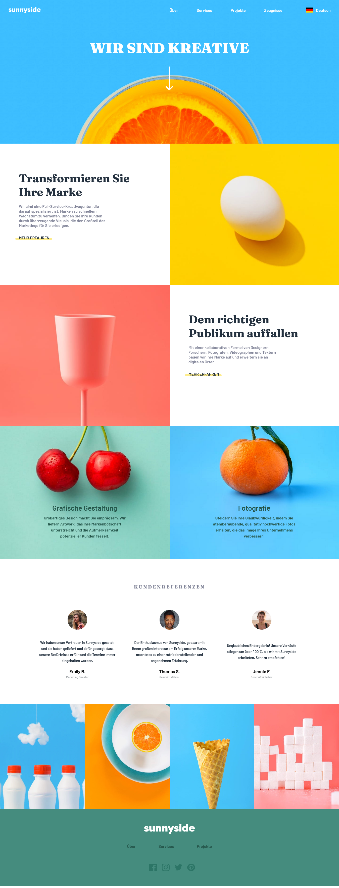

# NEW-SUNNY PWA

## Table of contents

- [Overview](#overview)
  - [The challenge](#the-challenge)
  - [Screenshot](#screenshot)
  - [Links](#links)
- [My process](#my-process)
  - [Built with](#built-with)
  - [What I learned](#what-i-learned)

## Overview

### The challenge

Users are be able to:

- view the optimal layout for each page depending on their device's screen size
- Visit page after loss of internet

### Screenshot

## My process

### Built with

- Semantic HTML5 markup
- CSS custom properties
- Flexbox
- CSS Grid
- Mobile-first workflow
- GSAP

### What I learned

Introduction to Service Worker and Manifest.json
